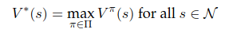

## Sources
1) Reinforcement Learning by Sutton and Barto: only provides a high-level intro to RL methods, but frustratingly short of mathematical backing to support it.
2) Foundations of Reinforcement Learning by Rao/Jelvis. Distills a more rigorous treatment of RL math with more explicit treatment.
3) Markov Decision Processes: Discrete Stochastic Dynamic Programming by Puterman. A rigorous treatment of MDPs and math.

## Maths

1) Average reward: One principle is that a state's value is the average of rewards experience from that state. Consider an n-armed bandit arm estimate as the sum of rewards for that action (pulling this arm) as Q_a = 1/k Sum_k(r_i). This can be shown equivalent to Q_a = Q_a + 1/k [r_k - Q_a], (omitting step indices here for simplicity). 
    * The result leads directly to the form of many following equations:
        * New value = old value + step_size * [reward - old value]
        * The value `reward - old value` is the *error* by which estimates are update (note the connection to ML error funcs)
    * Recency-weighted averages are also possible for non-stationary problems.
2) Discount factor γ: via the calculus result for geometric series' convergence, the series converges if γ is in 0 < γ < 1.
    * γ close to 0 is a myopic agent, favoring immediate rewards
    * γ closer to 1 is a long-term reasoning agent
    * Think of a maze: γ = 0 means the agent would usually get stuck in local maxima, favoring immediate rewards instead of discovering long term optimal behavior that requires a sequence of sub-optimal actions.

2) Finite MDPs: a finite MDP is fully specified by the transition model P(s_t+1 = s' | s_t = s ^ a_t = a) and the reward function R = E{ r_t+1 | s+t = s, a_t = a, s_t+1 = s'}. In english, P represent the probabilities of reaching successor states given actions, and R represents the expected rewards for those events.
    * The value function for a policy Pi is formally defined as V(s) = E{ R_t | s_t }, which is the expected reward starting in state s and following Pi thereafter.
    * The Q function simply extends this with actions: Q(a,s) = E{ R_t | s_t = s ^ a_t = a }.
    * Directly from V(s) above, we can derive its concrete expression:
        
    * Calculating V(s) for a given policy Pi is often referred to as the *prediction* problem.
4) Optimality: the language around this subject often sucks and is highly-ambiguous. Sutton for example does a fairly poor job explaining Pi*, the optimal policy, and its relationship to value functions:
    * Pi* is a policy which yields the greatest possible value over the long term. Formally, Pi* yields the *value function V\*(s)* that gives the greatest value. Pi* is **not** for a given/arbitrary V(s).
        
        * Source: RL for Finance, 2.10 (Great explication!)

5) Mathematically the *prediction* problem (policy evaluation) must be separated from the *control* problem (updating the policy to a better one). Prediction is rooted in fixed-point theory. See Rao/Jelvis, their treatment with full math is very lucid.

## Method Families for Trad RL
0) Direct Evaluation and N-Armed Bandits: this math is for simpler problems or to elucidate principles upon which later methods are developed.
    * A state's value can be estimated directly from its average reward.
    * The rewards need not be explicitly stored since the average is equivalent to the difference equation (see Sutton 2.5):
        * 1/(k+1) * Sum_k(r_i) == Q_k + 1/(k+1) [r_k+1 - Q_k]
        * In english: the explicit average is equivalent to the old value plus the weighted difference of the current reward and old value.
1) DP: Dynamic programming methods are derived directly from the Bellman equations and assume complete knowledge of the transition model and environment dynamics, thus typically required to be stationary.
    * Policy evaluation (prediction), policy improvement, value 
2) Monte Carlo: MC methods estimate state values directly based on the average of values obtained after visiting those states, as long as all states are visited 'infinitely often'.
    * Allow estimating value at only one state or subset of states.
    * Allow both on and off-policy learning, which does allow bootstrapping from human experience.
3) Temporal Differences: Like Monte Carlo methods, TD methods do not require a model of the environment; like DP methods, then estimate values stepwise from subsequent state values (bootstrapping).
    * TD(0): estimates state value directly based on rewards and subsequent state (t+1) value
    * SARSA: same as TD(0) but uses Q(s,a) instead of V(s)
    * Q-Learning: An off-policy version of SARSA using max_a (Q(s_t+1, a)) instead of merely Q. Note that this max directly extends the definition for the maximum value function for successor states, V*(s') = argmax_a(Q(s',a). See Rao/Jelvis 2.9.
    * Off vs. on policy: a key difference is that TD(0) and SARSA estimate value based on the actions taken in subseqent states. Q-Learning does not, instead taking the max value of the subsequent state based on argmax(a'), thus it learns independently from its current policy.

## Policy Improvement Theorem